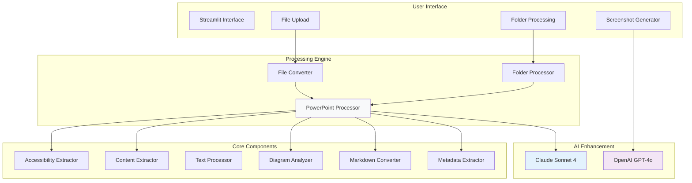
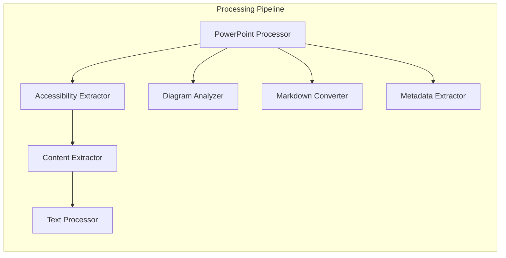
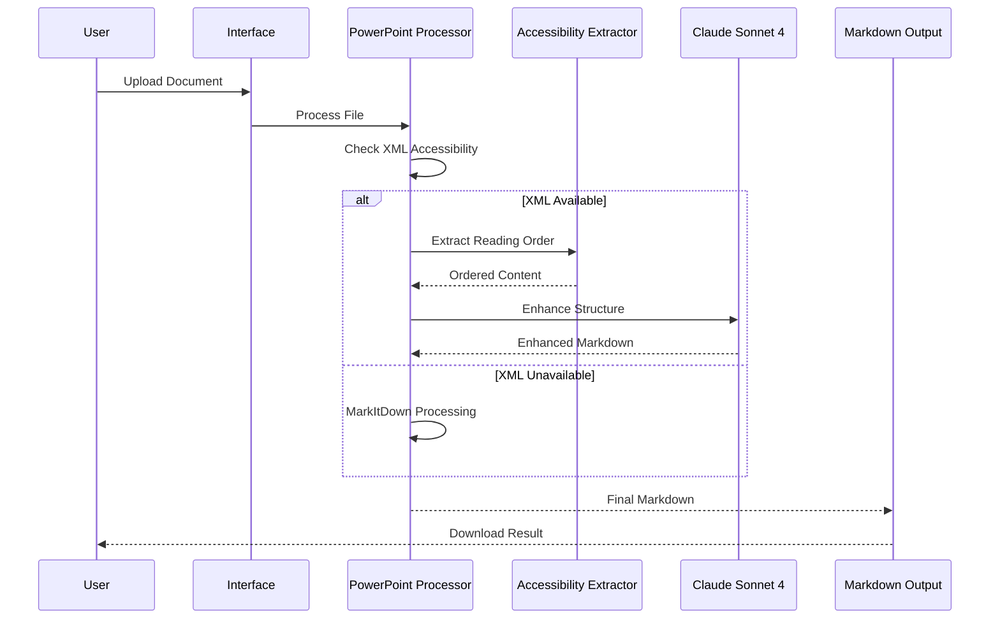
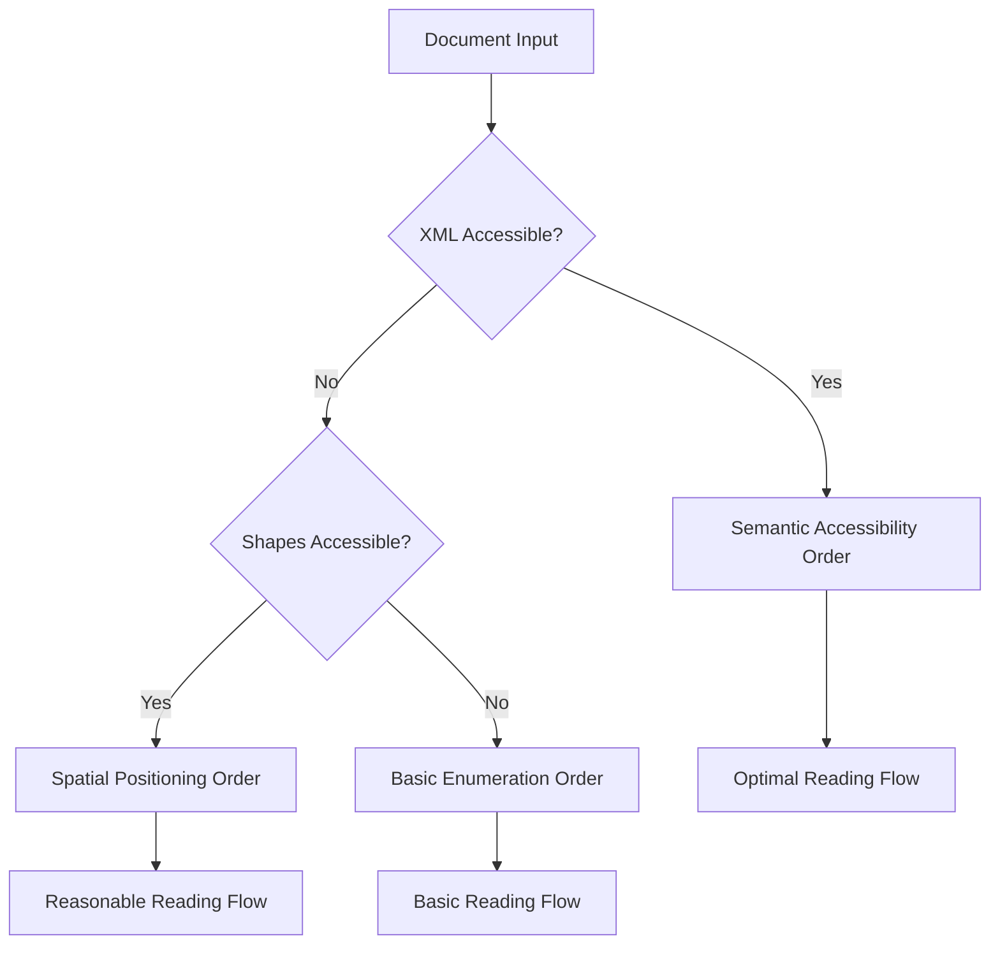
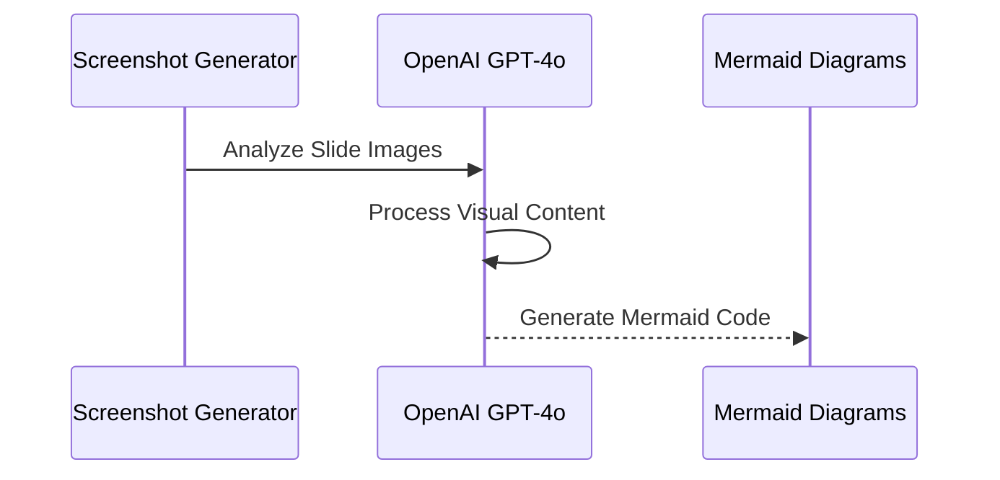
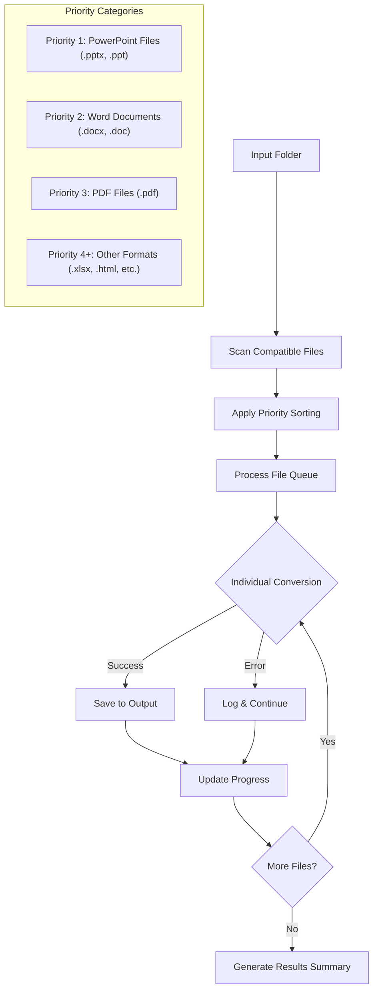
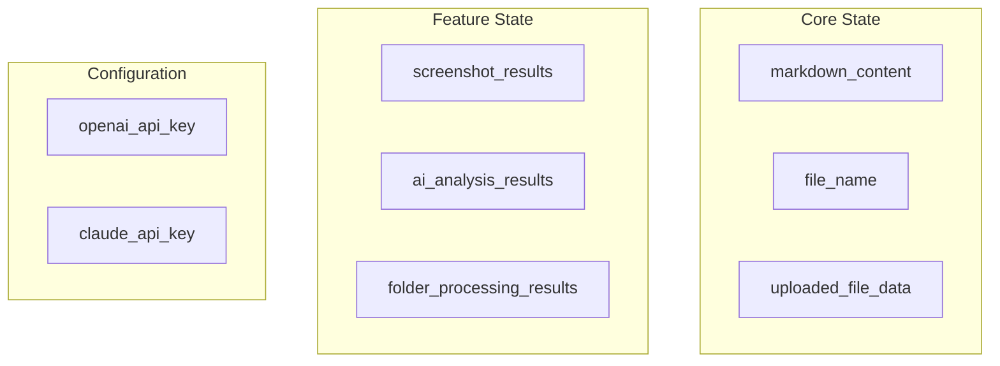

# Document to Markdown Converter

## Technical Documentation

---

A sophisticated document processing engine designed for AI training and RAG systems. Features intelligent PowerPoint processing with XML-first architecture and Claude Sonnet 4 enhancement.


### Status & Purpose

This application serves as a **demonstration platform** for our core PowerPoint processing engine. While the Streamlit interface showcases capabilities, the primary objective is developing a robust **API service** for enterprise document processing pipelines.

**Current Status**
- Core PowerPoint Processing: **Production Ready**
- Single File Conversion: **Production Ready** 
- Folder Processing: **In Development**
- Diagram Detection: **Experimental**

**Target Vision**: Convert to API service for enterprise document workflows


---


## Architecture Overview

The system implements a dual-strategy approach for document processing, automatically selecting the optimal method based on document accessibility.




---


## Core Design Principles

### XML-First Architecture

The PowerPoint processor employs a sophisticated strategy selection system:

**Primary Strategy**: XML-based processing when PowerPoint XML structure is accessible
- Semantic content extraction
- Accessibility-aware reading order  
- Advanced formatting preservation
- Comprehensive metadata extraction

**Fallback Strategy**: MarkItDown library for reliable basic conversion
- Simple text extraction
- Standard formatting
- Universal compatibility
- Error resilience


### Component-Based Design

Modular architecture with clear separation of concerns:




### Graceful Degradation

Each component handles failures elegantly:
- XML processing failure → MarkItDown fallback
- Claude API failure → Standard processing  
- Component failure → Reduced functionality, not system crash


---


## Data Flow Architecture




---


## PowerPoint Processing Engine

### Component Responsibilities

**PowerPoint Processor**
Main orchestrator implementing dual-strategy processing. Decides XML vs MarkItDown approach and coordinates component pipeline.

**Accessibility Order Extractor**  
Determines proper reading order for slide content. Critical for accessibility compliance and content understanding.

**Content Extractor**
Routes content extraction based on shape types. Handles text, tables, groups, charts, and other PowerPoint elements.

**Text Processor**
Advanced text formatting with XML-driven detection. Preserves styling, bullets, and hierarchical structure.

**Diagram Analyzer**
Identifies potential diagrams using sophisticated scoring algorithms. Flags slides suitable for visual processing.

**Markdown Converter**
Converts structured data to clean markdown format. Optimized for AI training and vector database storage.

**Metadata Extractor**
Extracts comprehensive PowerPoint metadata including author, creation date, and document properties.


### Reading Order Intelligence

The system implements three reading order strategies:




---


## AI Enhancement Pipeline

### Claude Sonnet 4 Integration

Transforms raw markdown into publication-ready content:

- **Structure Optimization**: Fixes bullet hierarchies and header organization
- **Content Enhancement**: Reorders sequences and improves readability  
- **Format Preservation**: Maintains all hyperlinks and styling
- **Metadata Generation**: Adds comprehensive context for vector databases


### OpenAI Diagram Analysis

Experimental feature for visual content processing:




---


## Folder Processing Architecture

Batch processing system with intelligent file prioritization:




---


## Session State Management

Strategic state management for complex application workflows:




---


## Getting Started

### Demo Application

**Installation**
```bash
pip install -r requirements.txt
streamlit run app.py
```

**API Keys Required**
- Anthropic API Key: [console.anthropic.com](https://console.anthropic.com/)
- OpenAI API Key: [platform.openai.com](https://platform.openai.com/)


### Production Integration

For enterprise workflows, integrate core components directly:

```python
# Basic conversion
from src.processors.powerpoint import convert_pptx_to_markdown_enhanced

markdown = convert_pptx_to_markdown_enhanced("presentation.pptx")

# Advanced processing
from src.processors.powerpoint import PowerPointProcessor

processor = PowerPointProcessor(use_accessibility_order=True)
summary = processor.get_processing_summary("presentation.pptx")
markdown = processor.convert_pptx_to_markdown_enhanced("presentation.pptx")

# AI enhancement
from src.converters.claude_markdown_convertor import ClaudeMarkdownEnhancer

enhancer = ClaudeMarkdownEnhancer(api_key="your-key")
enhanced_markdown, error = enhancer.enhance_markdown(
    markdown, 
    "presentation.pptx", 
    "PowerPoint Presentation"
)
```


---


## Development Roadmap

### Phase 1: Demonstration Platform
**Current Status**
- Streamlit interface for capability showcase
- Core PowerPoint processing engine
- AI enhancement integration
- User-friendly testing environment


### Phase 2: API Service Development  
**Target Implementation**
- RESTful API endpoints
- Authentication and rate limiting
- Async processing capabilities
- Docker containerization
- Comprehensive documentation


### Phase 3: Enterprise Integration
**Future Vision**
- Python SDK for seamless integration
- Webhook support for automation
- Multi-tenant architecture
- Monitoring and analytics
- Scalable deployment options


---


## Configuration System

Centralized configuration management:

```python
# Model Configuration
CLAUDE_MODEL = "claude-sonnet-4-20250514"
CLAUDE_MAX_TOKENS = 4096
CLAUDE_TEMPERATURE = 0.1

# Processing Priorities
PROCESSING_PRIORITIES = {
    "pptx": 1,  # Highest priority
    "ppt": 1,
    "docx": 2,
    "pdf": 3
}
```


---


## Extension Points

The modular architecture supports straightforward extension:

**New Document Formats**
Add to `FILE_FORMATS` configuration

**Additional Processors** 
Implement standard processor interface

**AI Provider Integration**
Extend enhancement pipeline  

**Custom Extractors**
Build on component system


---


## Performance Considerations

### Optimization Strategies
- Lazy loading of dependencies
- Component instance reuse
- Selective processing pipelines
- Sequential slide processing for memory management

### Scalability Features  
- PowerPoint processing optimization
- Efficient batch operations
- API rate limit handling
- Progress tracking for long operations


---


## Key Files Reference

| Component | Location | Purpose |
|-----------|----------|---------|
| Main Application | `app.py` | Streamlit orchestration |
| PowerPoint Engine | `src/processors/powerpoint/` | Component architecture |
| AI Enhancement | `src/converters/claude_markdown_convertor.py` | Claude integration |
| User Interface | `src/ui/` | Modular interface components |
| Configuration | `config.py` | System settings |


---


**Architecture designed for maintainability and extensibility**

*This documentation provides comprehensive understanding of the codebase architecture, data flows, and future development possibilities.*
